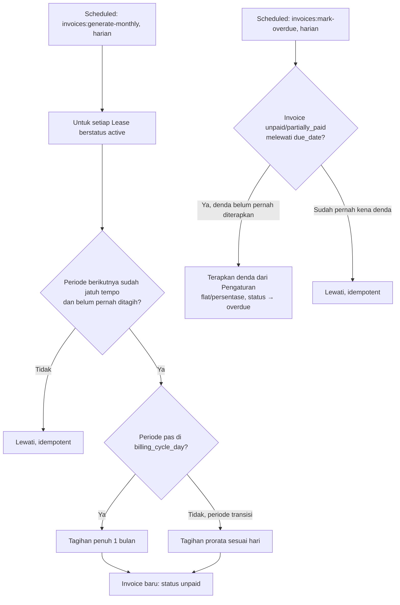
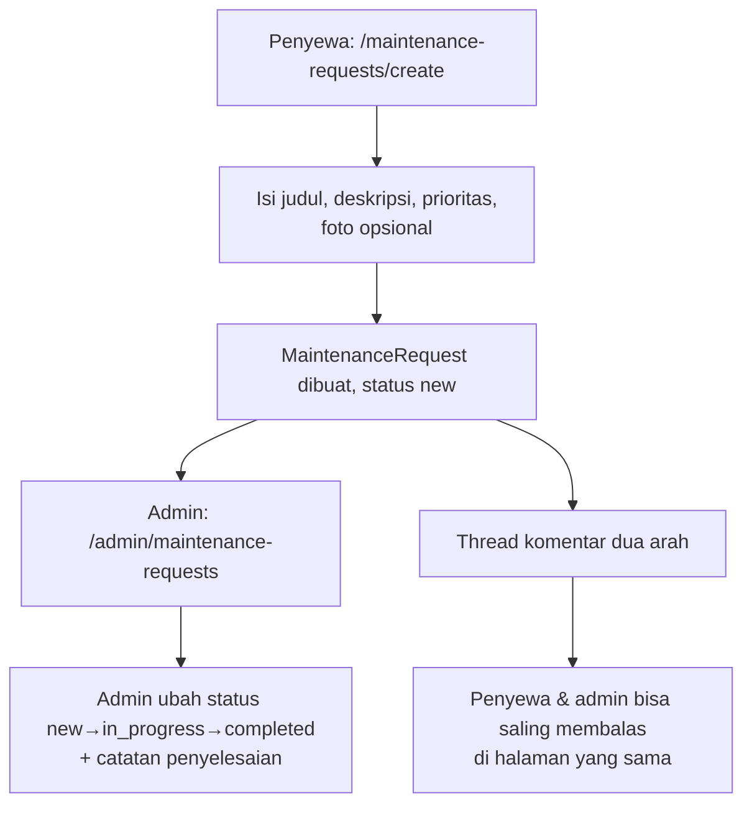

# Alur Pengguna

## 1. Pengunjung menjelajahi kamar tanpa login

```mermaid
flowchart LR
    A[Buka demera.my.id] --> B{Pilih lini bisnis}
    B -->|Demera Living| C[/living]
    B -->|Demera Fashion| D[/fashion — Segera Hadir]
    C --> E[/living/rooms — katalog + filter]
    E --> F[/living/rooms/slug — detail]
    F --> G{Tombol Pesan Sekarang}
    G -->|Kamar tersedia| H[/living/rooms/slug/book\nwajib login]
    G -->|Kamar tidak tersedia| I[Tombol nonaktif, keterangan jujur]
    F --> J[Tombol WhatsApp — aktif, langsung wa.me]
```

Menjelajahi katalog dan detail kamar tidak memerlukan login — hanya langkah "Pesan
Sekarang" yang mengharuskannya.

## 2. Registrasi & verifikasi

```mermaid
flowchart TD
    A[/register] --> B[Isi nama, email, WhatsApp, password]
    B --> C[Centang Syarat Penggunaan & Kebijakan Privasi]
    C --> D{Submit}
    D -->|WhatsApp/email sudah dipakai| E[Error validasi, tetap di form]
    D -->|Valid| F[User dibuat, role customer otomatis]
    F --> G[Auto-login, redirect ke /dashboard]
    G --> H[Middleware verified memaksa ke /verify-email]
    H --> I[Klik tautan verifikasi di email]
    I --> J[email_verified_at terisi]
    J --> K[Dashboard pengguna dapat diakses penuh]
```

## 3. Login (email atau WhatsApp)

```mermaid
flowchart TD
    A[/login] --> B[Isi kolom \"Email atau WhatsApp\" + password]
    B --> C{Format terdeteksi email?}
    C -->|Ya| D[Auth::attempt email+password]
    C -->|Tidak| E[Auth::attempt whatsapp_number+password]
    D --> F{Berhasil?}
    E --> F
    F -->|Gagal 5x dalam 1 menit| G[Rate limited, tunggu N detik]
    F -->|Berhasil| H{must_change_password?}
    H -->|true, contoh: akun admin baru| I[/force-password-update — wajib]
    H -->|false| J[/dashboard — redirect sesuai role]
```

## 4. Pemesanan kamar (booking)

```mermaid
flowchart TD
    A[/living/rooms/slug/book] --> B[Isi tanggal mulai, durasi, data penghuni]
    B --> C[Unggah KTP bila belum ada di profil]
    C --> D{Submit}
    D -->|Kamar sudah tidak Available\nrace condition dicegah row-lock| E[Error, kembali ke form]
    D -->|Valid| F[BookingLifecycleService::createHold\ntransaksi DB + row lock]
    F --> G[Kamar → Held, kode booking dibuat,\ninvoice pertama diterbitkan\nsewa bulan 1 + deposit + biaya admin]
    G --> H[/bookings/kode — halaman konfirmasi]
    H --> I{Bayar sebelum batas waktu?}
    I -->|Ya, tepat waktu| J[Lanjut ke Alur 5: Pembayaran]
    I -->|Tidak, lewat batas| K[Scheduled command bookings:expire\ntiap 5 menit]
    K --> L[Booking → expired, kamar → Available lagi]
```

## 5. Pembayaran manual (transfer bank atau QRIS)

```mermaid
flowchart TD
    A[/invoices/invoice/pay] --> B{Pilih metode}
    B -->|Transfer Bank| C[Tampil nomor rekening dari Pengaturan]
    B -->|QRIS| D[Tampil gambar QRIS yang diunggah admin]
    C --> E[Unggah bukti transfer]
    D --> E[Unggah bukti pindai QRIS]
    E --> F[Payment dibuat, status pending]
    F --> G[Admin: /admin/payments]
    G --> H{Verifikasi bukti}
    H -->|Ditolak| I[Payment → failed, alasan dicatat,\ncustomer unggah ulang]
    H -->|Diverifikasi| J[Payment → paid, invoice.paid_amount bertambah]
    J --> K{Invoice lunas penuh?}
    K -->|Ya, dan terkait booking| L[BookingLifecycleService::confirm\nTenant + Lease + Deposit dibuat,\nkamar → Occupied]
    K -->|Tidak, sebagian| M[Invoice → partially_paid]
    L --> N[Notifikasi payment_verified + booking_confirmed\ntercatat in-app + log WhatsApp/email]
```

## 6. Tagihan bulanan & keterlambatan (otomatis)



## 7. Perpanjangan, pindah kamar, dan akhiri sewa (admin)

```mermaid
flowchart LR
    A[/admin/leases/lease] --> B{Pilih aksi}
    B -->|Perpanjang| C[Isi tambahan bulan + harga baru opsional]
    C --> D[LeaseExtension dicatat,\nend_date & monthly_price lease diperbarui]
    B -->|Pindah Kamar| E[Pilih kamar tujuan yang Available]
    E --> F[Lease lama → completed, kamar lama → Available,\nLease baru dibuat, kamar baru → Occupied]
    B -->|Akhiri Sewa| G[Isi jumlah deposit dikembalikan + catatan potongan]
    G --> H[Lease → completed, Tenant → inactive,\nkamar → Available, Deposit diselesaikan]
```

## 8. Keluhan & perawatan (dua arah)



## 9. Pengingat otomatis & pusat notifikasi

```mermaid
flowchart TD
    A[Scheduled: notifications:send-due-reminders, harian] --> B{Invoice jatuh tempo\nH-7/H-3/H-1/H0/H+1/H+3/H+7?}
    B -->|Ya, belum dikirim hari ini| C[NotificationDispatcher::dispatch]
    B -->|Sudah dikirim| D[Lewati, idempotent]
    A --> E{Lease berakhir dalam 30 hari,\nbelum diberitahu 7 hari terakhir?}
    E -->|Ya| C
    C --> F[Notification in-app dibuat\n+ NotificationLog in_app]
    C --> G[Driver channel template\nLogWhatsAppDriver / LogEmailDriver\nmencatat log, belum kirim sungguhan]
    F --> H[Lonceng notifikasi di layout\nmenampilkan badge belum dibaca]
    H --> I[/notifications — tandai dibaca]
    J[Scheduled: notifications:retry-failed, tiap jam] --> K{Ada log berstatus failed,\nattempts < 3?}
    K -->|Ya| L[Coba ulang, status → sent]
```

## 10. Admin mengubah role pengguna

```mermaid
flowchart TD
    A[/admin/users] --> B[Cari pengguna]
    B --> C[Klik Atur Role]
    C --> D[Centang/hapus centang role di modal]
    D --> E{Submit}
    E --> F[syncRoles dijalankan]
    F --> G[audit_logs mencatat role_changed:\nrole lama vs role baru]
    G --> H[Nav sidebar pengguna tsb berubah\npada login/request berikutnya]
```

## 11. Keamanan akun: logout dari perangkat lain

```mermaid
flowchart TD
    A[/profile] --> B[Bagian \"Keluar dari Perangkat Lain\"]
    B --> C[Masukkan password saat ini]
    C --> D{Password benar?}
    D -->|Salah| E[Error validasi]
    D -->|Benar| F[Hash password di-rotate\n Auth::logoutOtherDevices]
    F --> G[Sesi di perangkat lain otomatis\nditolak pada request berikutnya\nlewat AuthenticateSession middleware]
    F --> H[Sesi di perangkat ini tetap aktif]
```

## 12. Fashion — pendaftaran notifikasi peluncuran

```mermaid
flowchart TD
    A[/fashion] --> B[Isi email dan/atau nomor WhatsApp]
    B --> C{Submit}
    C -->|Keduanya kosong| D[Error: isi salah satu]
    C -->|Sudah pernah daftar| E[Error: email/WhatsApp sudah terdaftar]
    C -->|Valid| F[Tersimpan ke fashion_launch_subscribers]
    F --> G[Pesan sukses: akan dikabari saat peluncuran]
```

## Alur yang belum ada (di luar cakupan 7 tahap)

Katalog/keranjang/checkout Demera Fashion penuh dan integrasi payment gateway pihak
ketiga sengaja tidak digambarkan — keduanya keputusan cakupan yang sadar (lihat
`docs/ROADMAP.md`), bukan bagian yang terlewat.
