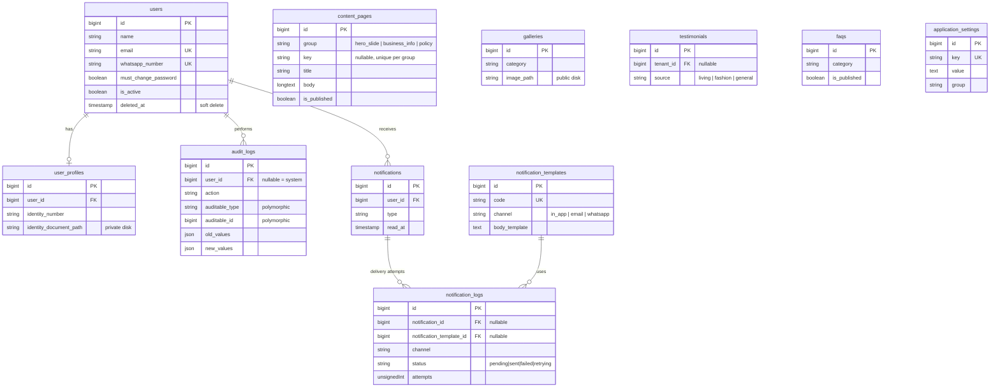
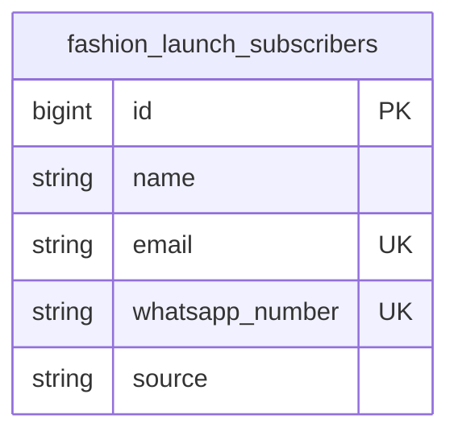
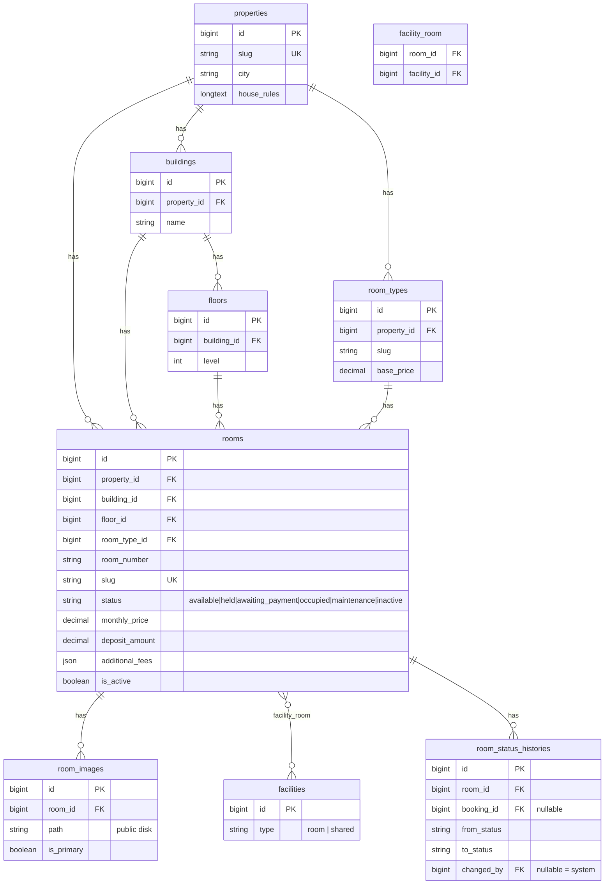

# Entity Relationship Diagram

Skema penuh ada di `database/migrations/`. Diagram di bawah menampilkan kolom kunci saja
(bukan seluruh kolom) supaya tetap terbaca — lihat file migration masing-masing tabel untuk
daftar kolom lengkap, index, dan constraint.

## Platform (autentikasi, CMS, notifikasi, audit)



## Fashion (isolated from Living)



*Tabel produk/kategori/keranjang/checkout Fashion belum ada — akan ditambahkan pada tahap
pengembangan Fashion berikutnya, sebagai tabel baru yang juga terisolasi dari Living.*

## Living — katalog properti



## Living — booking, penyewa, kontrak, tagihan, pembayaran

```mermaid
erDiagram
    users ||--o{ bookings : makes
    rooms ||--o{ bookings : "booked via"
    bookings ||--o{ booking_guests : has
    bookings ||--o{ booking_documents : has
    bookings ||--o| tenants : "converts to"
    users ||--o| tenants : becomes
    rooms ||--o{ tenants : "currently in"
    tenants ||--o{ leases : has
    rooms ||--o{ leases : "leased as"
    leases ||--o{ lease_extensions : has
    leases ||--o{ invoices : generates
    tenants ||--o{ invoices : owes
    invoices ||--o{ invoice_items : has
    invoices ||--o{ payments : "paid via"
    payments ||--o{ payment_webhooks : "confirmed by"
    payments ||--o{ refunds : has
    tenants ||--o{ deposits : has
    leases ||--o{ deposits : has
    tenants ||--o{ maintenance_requests : files
    rooms ||--o{ maintenance_requests : "reported on"
    maintenance_requests ||--o{ maintenance_attachments : has

    bookings {
        bigint id PK
        string booking_code UK
        bigint user_id FK
        bigint room_id FK
        string status "pending|awaiting_payment|confirmed|expired|cancelled|converted_to_lease"
        date start_date
        decimal total_amount
        timestamp payment_due_at
    }
    booking_guests {
        bigint id PK
        bigint booking_id FK
        string full_name
        boolean is_primary
    }
    booking_documents {
        bigint id PK
        bigint booking_id FK
        string document_type
        string file_path "private disk"
    }
    tenants {
        bigint id PK
        bigint user_id FK UK
        bigint room_id FK "nullable"
        bigint booking_id FK "nullable"
        string status "prospective | active | inactive"
    }
    leases {
        bigint id PK
        string lease_number UK
        bigint tenant_id FK
        bigint room_id FK
        bigint booking_id FK "nullable"
        date start_date
        date end_date
        decimal monthly_price "snapshot at signing"
        string status "draft|pending_approval|active|ending_soon|completed|cancelled|extended"
        string signed_document_path "private disk"
    }
    lease_extensions {
        bigint id PK
        bigint lease_id FK
        date new_end_date
        string status
    }
    invoices {
        bigint id PK
        string invoice_number UK
        bigint lease_id FK "nullable"
        bigint tenant_id FK "nullable"
        bigint booking_id FK "nullable"
        date due_date
        decimal total_amount
        decimal paid_amount
        string status "draft|unpaid|partially_paid|paid|overdue|cancelled|refunded"
    }
    invoice_items {
        bigint id PK
        bigint invoice_id FK
        string label
        decimal amount
    }
    payments {
        bigint id PK
        string payment_code UK
        bigint invoice_id FK
        string method "virtual_account|qris|ewallet|manual_transfer|cash"
        string status "pending|paid|failed|expired|cancelled|refunded|partially_paid"
        string idempotency_key UK "nullable"
        string proof_file_path "private disk, manual transfer"
    }
    payment_webhooks {
        bigint id PK
        bigint payment_id FK "nullable"
        string provider
        json payload
        boolean is_verified
        boolean is_processed
    }
    refunds {
        bigint id PK
        bigint payment_id FK
        decimal amount
        string status "requested|approved|rejected|processed"
    }
    deposits {
        bigint id PK
        bigint tenant_id FK
        bigint lease_id FK "nullable"
        decimal amount
        decimal returned_amount
        string status
    }
    maintenance_requests {
        bigint id PK
        bigint tenant_id FK "nullable"
        bigint room_id FK
        string priority "low|normal|high|urgent"
        string status "new|in_progress|waiting|completed|closed"
    }
    maintenance_attachments {
        bigint id PK
        bigint maintenance_request_id FK
        string file_path
    }
```

## Catatan desain

- **Harga sebagai snapshot**: `bookings.monthly_price`, `leases.monthly_price`, dan
  `invoices.subtotal_amount` menyalin harga dari `rooms`/`room_types` pada saat transaksi
  dibuat — perubahan harga katalog di kemudian hari tidak pernah mengubah kontrak yang
  sudah berjalan.
- **Uang selalu `decimal`**, tidak pernah `float`, di seluruh skema.
- **Soft delete** dipakai pada seluruh tabel master/transaksional yang relevan (users,
  properties, rooms, bookings, tenants, leases, invoices, payments, dst.) — lihat migration
  masing-masing untuk daftar pastinya.
- **Index komposit** pada kolom yang sering dipakai bersama di query hot-path:
  `rooms(property_id, status)`, `bookings(room_id, status)`, `bookings(status,
  payment_due_at)` (untuk job kedaluwarsa booking), `invoices(tenant_id, status)`,
  `invoices(due_date, status)` (untuk job pengingat jatuh tempo).
